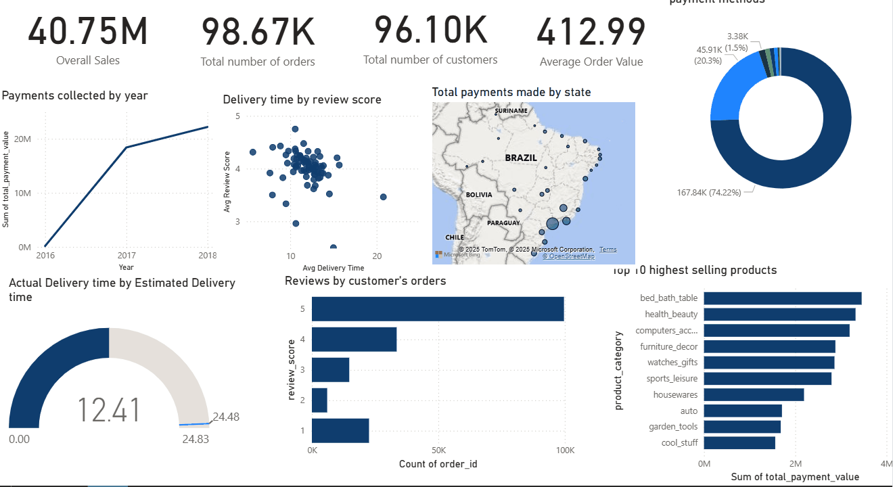

# End-to-End E-commerce Analysis: A Power BI Deep Dive into the Olist Dataset

## 1. Project Objective
This project is a comprehensive, end-to-end business intelligence analysis of the Olist E-commerce dataset. Acting as a BI Analyst, my primary objective was to transform a raw, 9-table relational database into a powerful, interactive Power BI dashboard. The final report is designed to provide actionable insights across sales, logistics, and customer satisfaction to guide strategic decision-making for a real-world marketplace.

---
## 2. Tech Stack
* **Database:** **SQLite** (managed with DBeaver)
* **Data Extraction & Transformation:** **SQL** (Multi-table `JOIN`s, aggregations, `CASE` statements)
* **Dashboarding & Visualization:** **Microsoft Power BI**

---
## 3. The Process
1.  **Database Creation:** I began by importing 9 separate CSV files into a relational database using SQLite, successfully recreating a schema that mirrors a real-world production environment.
2.  **SQL Querying:** I wrote a series of complex SQL queries to extract and pre-aggregate clean, analysis-ready data. This crucial "SQL-first" approach ensured the final Power BI report was fast and highly performant.
3.  **Data Modeling & DAX:** I connected the resulting query tables in Power BI to create a robust data model and wrote DAX measures to calculate key business metrics like Average Order Value.
4.  **Dashboard Design:** I designed and built a single-page, interactive dashboard in Power BI, focusing on a clean, intuitive layout that tells a clear story about the entire business funnel.

---
## 4. Key Findings & Strategic Recommendations

The analysis uncovered several critical insights into the Olist platform's operations:

* **Finding 1: The entire customer experience hinges on delivery speed.**
    * **Insight:** My analysis revealed a direct and undeniable correlation: the longer a delivery is delayed past its estimated date, the lower the customer's final review score. Late deliveries are the single biggest driver of customer dissatisfaction.
    * **Recommendation:** The company must invest in optimizing its logistics network. The data proves that faster, more reliable shipping will directly translate to higher customer satisfaction and a stronger brand reputation.

* **Finding 2: The business is heavily reliant on a single geographic region.**
    * **Insight:** The map visualization showed that the southeastern states (like São Paulo and Rio de Janeiro) account for the vast majority of both sales revenue and seller concentration.
    * **Recommendation:** This is a major risk and a huge opportunity. The company should launch a targeted marketing campaign and seller acquisition program in the underserved northern and central-western regions to diversify its revenue streams.

* **Finding 3: Seller inefficiency creates an inconsistent customer experience.**
    * **Insight:** There is a massive variance in the time it takes for sellers to ship an order, ranging from a few hours to over 60 days. This lack of a service standard makes the platform feel unreliable.
    * **Recommendation:** Implement a Service Level Agreement (SLA) for sellers. Reward top performers with a "Fast Shipper" badge and create a system to warn or penalize sellers who consistently ship late.

* **Finding 4: "Boleto" is a key payment method, but credit cards drive higher value.**
    * **Insight:** While credit cards are the most common payment method, the Brazilian "boleto" payment slip is a close second. However, the average transaction value is significantly higher for multi-installment credit card payments.
    * **Recommendation:** Continue to support boleto for user convenience, but create incentives (like small discounts or rewards) to encourage customers to use credit card installments, which will increase the average order value.

---
## 5. Final Dashboard & Interactive Demo

The final results were visualized in a comprehensive Power BI dashboard. All SQL query files used for this analysis are available in the `SQL_Queries` folder in this repository.

Since a live version cannot be shared publicly without a corporate account, here is a GIF demonstrating the dashboard's interactivity:

**(A full-size static image is below for detailed viewing)**

![Olist E-commerce Dashboard][(Olist_dashboard.png)](https://github.com/Ogezi-Emmanuel/PowerBI-Olist-Ecommerce-Analysis/blob/main/Olist%20_dashboard.png)
